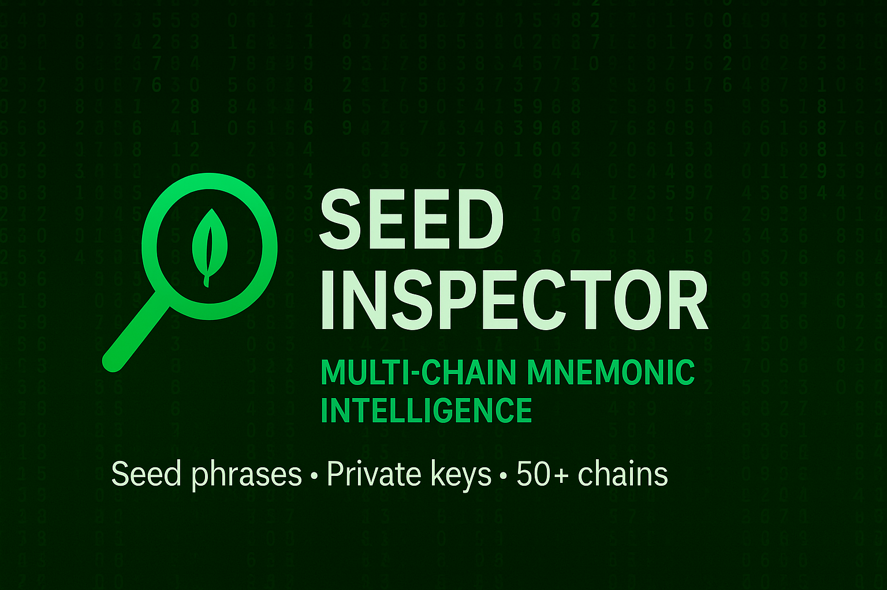

  

<h1 align="center">👑 Seed Inspector</h1>

  <b>Multi-Chain Mnemonic & Key Intelligence Engine</b> 
  Seed phrase & private key based wallet discovery across 50+ blockchains.

---

## What is Seed Inspector?

**Seed Inspector** is a multi-chain wallet discovery engine that derives and analyzes wallets  
from **seed phrases (mnemonics)** and **private keys**.

Unlike traditional wallet scanners that rely on known addresses,  
Seed Inspector operates at the **origin level** — the mnemonic itself.

This allows deep inspection across multiple chains from a single source.

---

## Core Capabilities

- Mnemonic-based HD wallet derivation  
- Private key scanning  
- Multi-chain asset discovery  
- Real balance aggregation (USD valuation)  
- Cross-network visibility from a single input  

Supported networks include **Ethereum, Bitcoin, Solana, Tron**, and **50+ chains**.

---

## Important Note

⚠️ **This is NOT a wallet checker.**  
Seed Inspector is a **wallet discovery & analysis engine**.

Addresses are symptoms.  
Seeds are the source.

---

